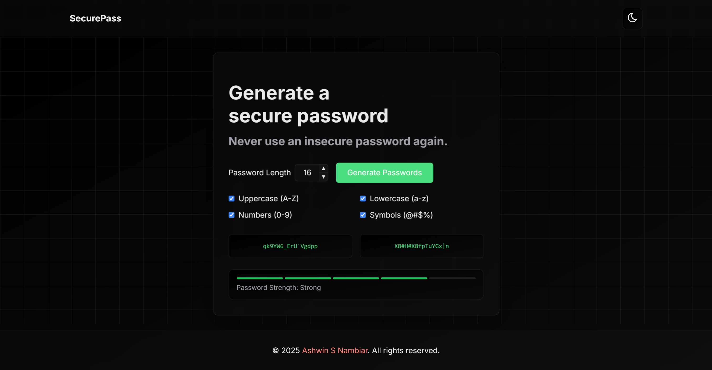
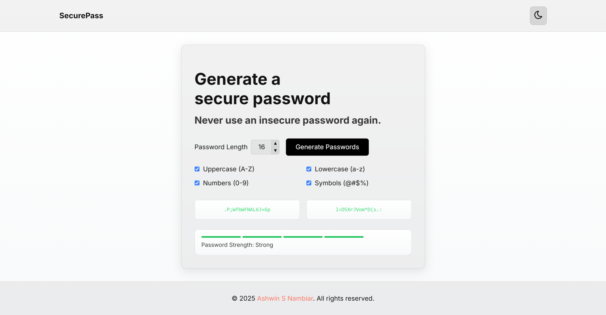
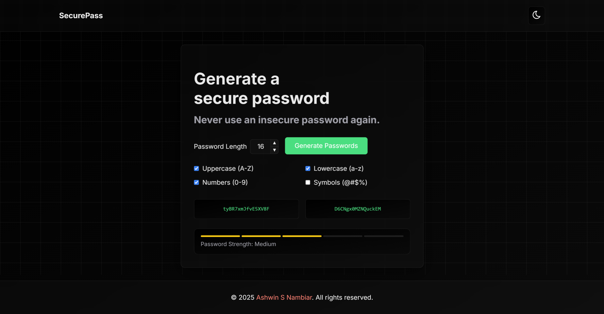
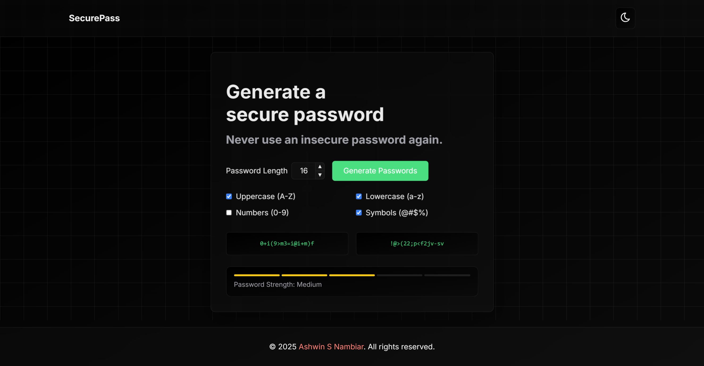

# SecurePass

<div align="center">


A powerful and user-friendly password generator that creates two random passwords based on user-specified criteria. Easily copy passwords with a single click for convenience and security.

[Features](#-features) • [Tech Stack](#-tech-stack) • [Installation](#-installation) • [Contributing](#-contributing) • [Screenshots](#-screenshots) • [Live](#-live) • [Author](#-author)

</div>

## Features

- **Customizable Password Length:** Generate passwords of your preferred size using a slider.
- **Character Set Selection:** Choose which character types to include: uppercase letters, lowercase letters, numbers, and special symbols.
- **Multiple Password Options:** Create two unique passwords simultaneously.
- **One-Click Copy:** Instantly copy generated passwords to your clipboard.
- **Random Password Generation:** Ensures unique and secure passwords each time.
- **Simple, Clean Interface:** User-friendly design for easy password creation.
- **Dark/Light Mode Switching:** Toggle between light and dark themes for comfortable use.

## Tech Stack

- **HTML5:** Semantic markup for structuring the content.
- **CSS3:** Responsive styling for a polished user interface.
- **JavaScript:** Password generation logic, interactivity, and theme switching.

## Installation

1. **Clone the Repository:**

      ```bash
      git clone https://github.com/Ashwin-S-Nambiar/password-generator.git

      cd password-generator
      ```

2.  **Open the Project:**

      **Simply open the `index.html` file in your web browser.  No further setup is required.**

## Contributing

Contributions are welcome! Here's how you can help improve SecurePass:

1.  **Fork the repository**

2.  **Create a feature branch:**
      ```bash
      git checkout -b feature/your-feature-name
      ```

3.  **Make your changes and commit them:**
      ```bash
      git commit -m 'Add some feature'
      ```

4.  **Push to the branch:**

      ```bash
      git push origin feature/your-feature-name
      ```

5.  **Open a Pull Request**

## Screenshots

<div align="center">

### SecurePass Interface (Dark Mode)



### SecurePass Interface (Light Mode)



### Option Selection






</div>

## Live

<div align="center">

[](https://pwrd-generator.netlify.app/)

</div>

-----

<div align="center">
Made with ❤️ by Ashwin S Nambiar
</div>
